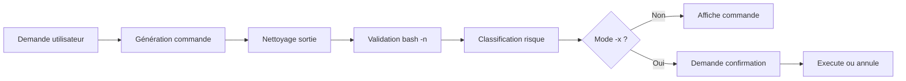

<p align="center">
  
</p>

<h1 align="center">IA Portable</h1>

<p align="center">
  <strong>Écris ce que tu veux faire. Reçois la commande Bash.</strong><br>
  Un assistant terminal simple, sobre, local-first, pensé pour produire une commande exploitable.
</p>

<p align="center">
  <a href="#installation"></a>
  <a href="#providers"></a>
  <a href="#providers"></a>
  <a href="LICENSE"></a>
</p>

<p align="center">
  <a href="#demo">Démo</a>
  ·
  <a href="#installation">Installation</a>
  ·
  <a href="#commandes">Commandes</a>
  ·
  <a href="#providers">Providers</a>
  ·
  <a href="#sécurité">Sécurité</a>
  ·
  <a href="#dépannage">Dépannage</a>
</p>

---

## Démo

`ia` ne bavarde pas par défaut. Il renvoie une seule ligne, directement utilisable.

```bash
$ ia "trouve les fichiers log de plus de 30 jours"
find . -type f -name "*.log" -mtime +30
```

Quand tu veux comprendre avant d'agir :

```bash
$ ia -e 'find . -type f -mtime +30 -delete'

Commande proposee :

find . -type f -mtime +30 -delete

Explication :
supprime les fichiers correspondant aux criteres de plus de 30 jours dans le dossier courant.

Risque :
Moyen - modification de fichiers, services, paquets ou privileges.
```

Quand tu veux exécuter avec confirmation :

```bash
$ ia -x "supprime les logs de plus de 30 jours dans /var/log"

Commande proposee :

find /var/log -type f -name "*.log" -mtime +30 -delete

Explication :
supprime les elements nommes *.log de plus de 30 jours dans /var/log.

Risque :
Moyen - modification de fichiers, services, paquets ou privileges.

Executer ? [y/N]
```

---

## Installation

```bash
git clone https://github.com/neosoda/ia-portable.git
cd ia-portable
sudo bash install.sh
```

<table>
  <tr>
    <td><strong>Prérequis</strong></td>
    <td>Bash 4+, <code>curl</code>, <code>jq</code>, <code>sudo</code> ou root</td>
  </tr>
  <tr>
    <td><strong>Installation</strong></td>
    <td>Place la commande <code>ia</code> dans <code>/usr/local/bin</code></td>
  </tr>
  <tr>
    <td><strong>Config</strong></td>
    <td>Stockée dans <code>~/.ia_config</code></td>
  </tr>
</table>

<details>
<summary><strong>Ce que fait l'installeur</strong></summary>

1. Demande le provider par défaut.
2. Installe `curl` et `jq`.
3. Installe Ollama si le mode local est choisi.
4. Construit le modèle local `ia-sysadmin` depuis `Modelfile`.
5. Installe la commande `ia`.

</details>

---

## Commandes

| Besoin | Commande | Sortie |
| --- | --- | --- |
| Obtenir une commande | `ia "ma demande"` | Commande seule |
| Comprendre avant d'agir | `ia -e "ma demande"` | Commande + explication + risque |
| Confirmer puis exécuter | `ia -x "ma demande"` | Prompt `Executer ? [y/N]` |
| Durcir la sécurité | `ia -s "ma demande"` | Refus plus strict |
| Forcer Ollama | `ia --provider ollama "ma demande"` | Provider local |
| Forcer OpenRouter | `ia --provider openrouter "ma demande"` | Provider cloud |
| Utiliser stdin | <code>cat fichier.log &#124; ia "trouve l'erreur"</code> | Commande compatible contexte |

<details open>
<summary><strong>Mode commande seule</strong></summary>

Fait pour rester scriptable, propre et rapide.

```bash
$ ia "combien de RAM libre ?"
free -h
```

```bash
$ ia "les 20 plus gros fichiers ici"
find . -type f -printf '%s %p\n' | sort -nr | head -20
```

</details>

<details>
<summary><strong>Mode explication</strong></summary>

`-e` affiche la commande, une explication courte et un niveau de risque.

```bash
$ ia -e "liste les connexions SSH actives"
```

Il peut aussi expliquer une commande existante :

```bash
$ ia -e 'find . -type f -mtime +30 -delete'
```

</details>

<details>
<summary><strong>Mode exécution</strong></summary>

`-x` garde un humain dans la boucle.

```bash
$ ia -x "redemarre nginx"
```

Les exécutions sont journalisées dans `~/.ia_history`.

</details>

<details>
<summary><strong>Mode strict</strong></summary>

`-s` refuse par défaut les commandes qui touchent aux suppressions, permissions, propriétaires, privilèges, redirections d'écriture ou opérations système critiques.

```bash
$ ia -s "nettoie les vieux logs"
```

</details>

---

## Pipe stdin

Donne du contexte à `ia` sans perdre la sortie exploitable.

```bash
$ tail -100 /var/log/syslog | ia "trouve les erreurs"
grep -i error
```

```bash
$ cat access.log | ia "compte les IP les plus frequentes"
awk '{print $1}' | sort | uniq -c | sort -nr | head
```

---

## Providers

<table>
  <tr>
    <th>Provider</th>
    <th>Quand l'utiliser</th>
    <th>Commande</th>
  </tr>
  <tr>
    <td><strong>Ollama</strong></td>
    <td>Local-first, données sur la machine</td>
    <td><code>ia --provider ollama "diagnostique nginx"</code></td>
  </tr>
  <tr>
    <td><strong>OpenRouter</strong></td>
    <td>Réponses cloud plus robustes, fallback modèles</td>
    <td><code>ia --provider openrouter "trouve pourquoi systemd relance ce service"</code></td>
  </tr>
</table>

Liens utiles :

- [Ollama](https://ollama.com)
- [OpenRouter](https://openrouter.ai)
- [Bash Reference Manual](https://www.gnu.org/software/bash/manual/bash.html)

Configuration runtime :

```bash
export IA_LOCAL_API_URL="http://localhost:11434/api/generate"
export IA_LOCAL_MODEL="ia-sysadmin"
export OPENROUTER_API_KEY="..."
```

Choisir le provider par défaut :

```bash
ia --config
```

---

## Sécurité

`ia` n'est pas un agent autonome. Il propose une commande, et n'exécute qu'avec `-x` après confirmation.



Garde-fous inclus :

- sortie commande seule par défaut ;
- validation syntaxique via `bash -n` ;
- classification de risque : `Faible`, `Moyen`, `Eleve`, `Bloque` ;
- refus d'exécution des commandes critiques ;
- mode strict pour refuser les actions destructrices ;
- historique local dans `~/.ia_history`.

> Le modèle peut se tromper. Relis toujours avant d'exécuter.

---

## Exemples

<details open>
<summary><strong>Diagnostic système</strong></summary>

```bash
$ ia "espace disque lisible"
df -h
```

```bash
$ ia "processus qui consomment le plus de CPU"
ps aux --sort=-%cpu | head
```

</details>

<details>
<summary><strong>Fichiers</strong></summary>

```bash
$ ia "trouve les fichiers modifies aujourd'hui"
find . -type f -mtime -1
```

```bash
$ ia -e "archive ce dossier en tar.gz"
```

</details>

<details>
<summary><strong>Logs</strong></summary>

```bash
$ journalctl -u nginx -n 200 | ia "filtre les erreurs"
grep -i error
```

</details>

---

## Dépannage

<details>
<summary><strong>Ollama ne répond pas</strong></summary>

```bash
curl -s http://localhost:11434
systemctl restart ollama
```

</details>

<details>
<summary><strong>Le modèle local manque</strong></summary>

```bash
ollama list
ollama create ia-sysadmin -f Modelfile
```

</details>

<details>
<summary><strong>Changer de provider</strong></summary>

```bash
ia --config
```

</details>

---

## Structure

```text
.
├── docs/assets/ia-portable-hero.svg
├── ia.sh
├── install.sh
├── Modelfile
├── README.md
├── LICENSE
└── .gitignore
```

---

<p align="center">
  <strong>IA Portable</strong> · MIT · conçu pour rester simple dans le terminal
</p>
